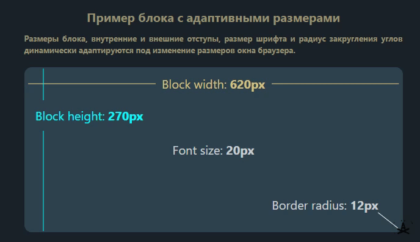

# Clamp Calculator

Десктопное приложение для расчёта CSS-функции [`clamp()`](https://developer.mozilla.org/en-US/docs/Web/CSS/clamp): размеры шрифта, отступы и другие значения с плавным масштабированием между минимальной и максимальной шириной viewport.

Собрано на **Tauri 2** + **React** + **Vite**. Веб-версия проекта: [clamp-calculator](https://github.com/OlegKrechkovskiy/clamp-calculator).



## Возможности

- Расчёт `clamp(min, preferred, max)` по заданным параметрам
- Единицы `px` и `rem`
- Переключение языка (RU / EN)
- Копирование результата в буфер обмена
- Живой пример с изменяемым блоком

## Требования

- [Node.js](https://nodejs.org/) 18+
- [Rust](https://www.rust-lang.org/tools/install) (для сборки Tauri)
- Зависимости платформы для Tauri — см. [документацию](https://v2.tauri.app/start/prerequisites/)

## Установка

```bash
npm install
```

## Разработка

Запуск приложения с hot-reload:

```bash
npm run tauri dev
```

Только фронтенд (без окна Tauri):

```bash
npm run dev
```

## Сборка

```bash
npm run tauri build
```

Артефакты появятся в `src-tauri/target/release/bundle/` (`.app`, `.dmg` на macOS и т.д.).

## Иконки приложения

Иконки для Tauri генерируются из `public/web-app-manifest-512x512.png`:

```bash
npm run tauri icon public/web-app-manifest-512x512.png
```

Результат сохраняется в `src-tauri/icons/`. Файлы в `public/` используются для favicon и web manifest внутри UI.

## Структура проекта

```
├── src/                 # React-приложение
├── public/              # Статика (иконки, preview)
├── src-tauri/           # Rust-оболочка Tauri
│   └── icons/           # Иконки для сборки десктопа
└── dist/                # Сборка фронтенда (генерируется)
```

## Веб-версии

- [clampcalculator.vercel.app](https://clampcalculator.vercel.app/)
- [clamp-calculate.netlify.app](https://clamp-calculate.netlify.app/)

## Автор

- [GitHub](https://github.com/OlegKrechkovskiy)
- [Telegram](https://t.me/olegkrech)

## Лицензия

MIT
